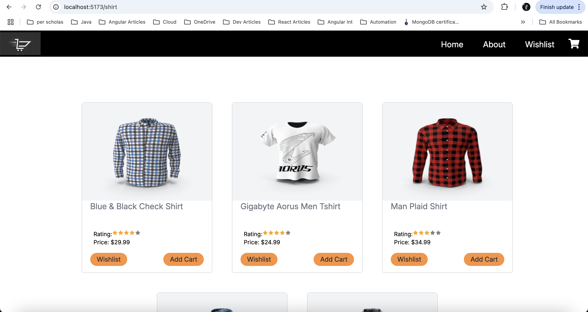
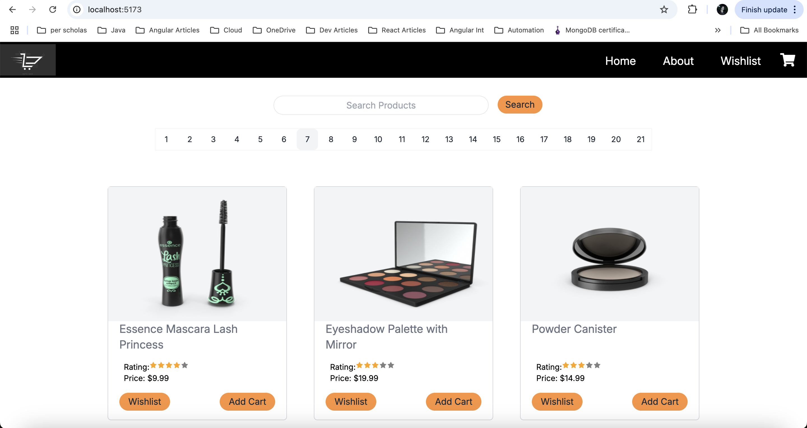
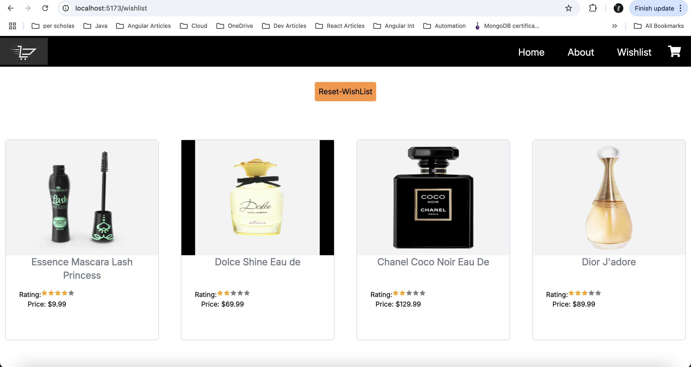
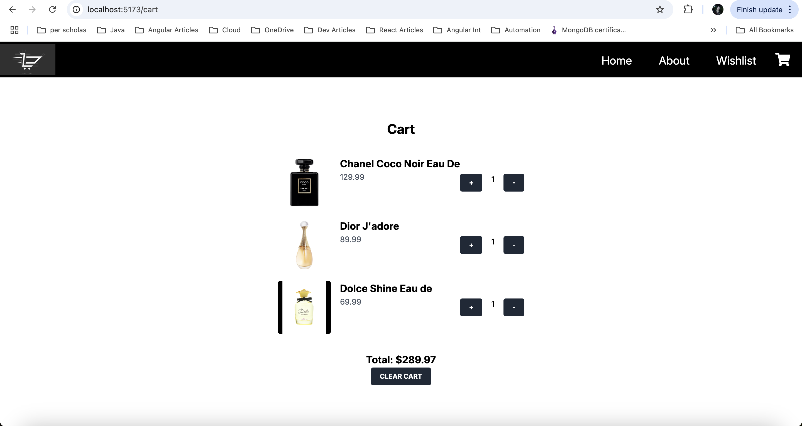
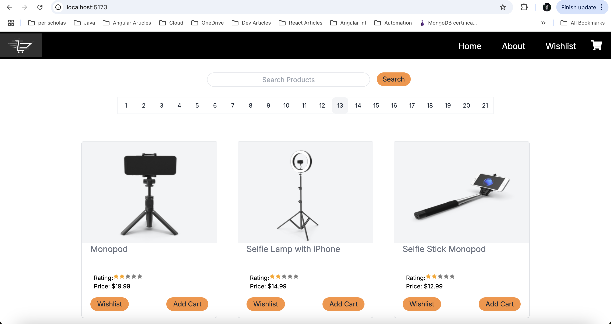

# E-Commerce Site (Retail Online Shop)

## Technologies Used

- HTML
- CSS used Tailwind
- Javascript
- React
- UseContext

## Approach Taken

- Divide E-commerce site functionality into three parts. First being fetching products data into Home page using fetch and displaying it in home page. Used useState as well useContext to manage state.
- Used Local storage it store and retrieve items in cart and wishlist component.
- Used react-router-dom to manage routing. Used Tailwind CSS framework for design.
- Used Pagination on Home page to navigate to different pages as well as implemented Search functionality on Home page.For search functionality used useNavigate hook to navigate to that component.
- For Products rating used Star component.
- Used FavIcon at certain places.
- Created Sticky navbar for all pages and Carousel on About page.
- On Home page while displaying products as cards provided Wishlist as well as Add to cart functionality.
- Products added to cart can be viewed on Cart component and products added to wishlist can be viewed on wishlist page. There is Reset functionality on both cat and wishlist page.

## Link To Live Site

https://ecom-retail.netlify.app/

## Usage instructions, if relevant.

- User can navigate to https://ecom-retail.netlify.app/ site.
- This lands the user to Home page, Home page shows some products, pagination is provided on the top to visit different pages.
- Add to cart and wishlist button are there to add to cart and wishlist that can be viewed at Wishlist and cart provided at the navbar.
- About takes to Carousel.
- Cart takes to cart component.

## Unsolved problems

- To implement a fully functional e-commerce website need to add Order placement, checkout components.
- Also Products sorting, filtering and various other functionalities.
- Login, authentication, user management for fully functional website.

## Output

- Home

- Search

- Wishlist

- Cart

- Carousel

- Sticky Nav

